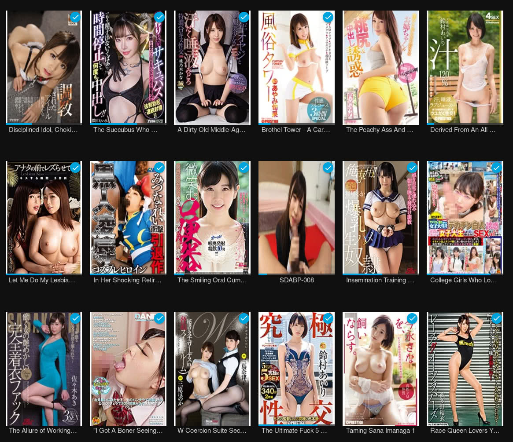
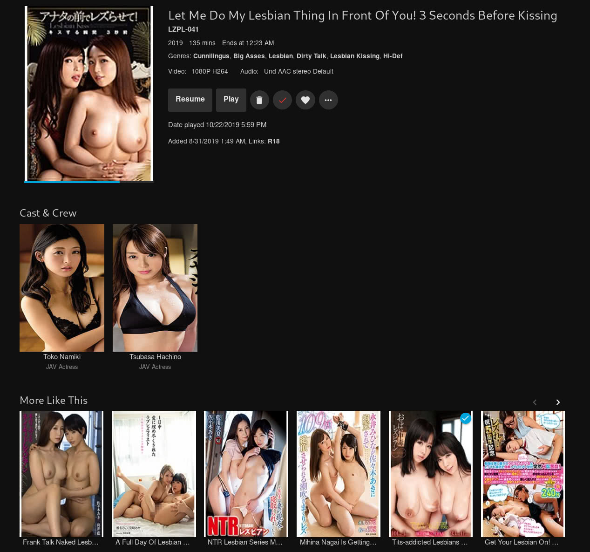
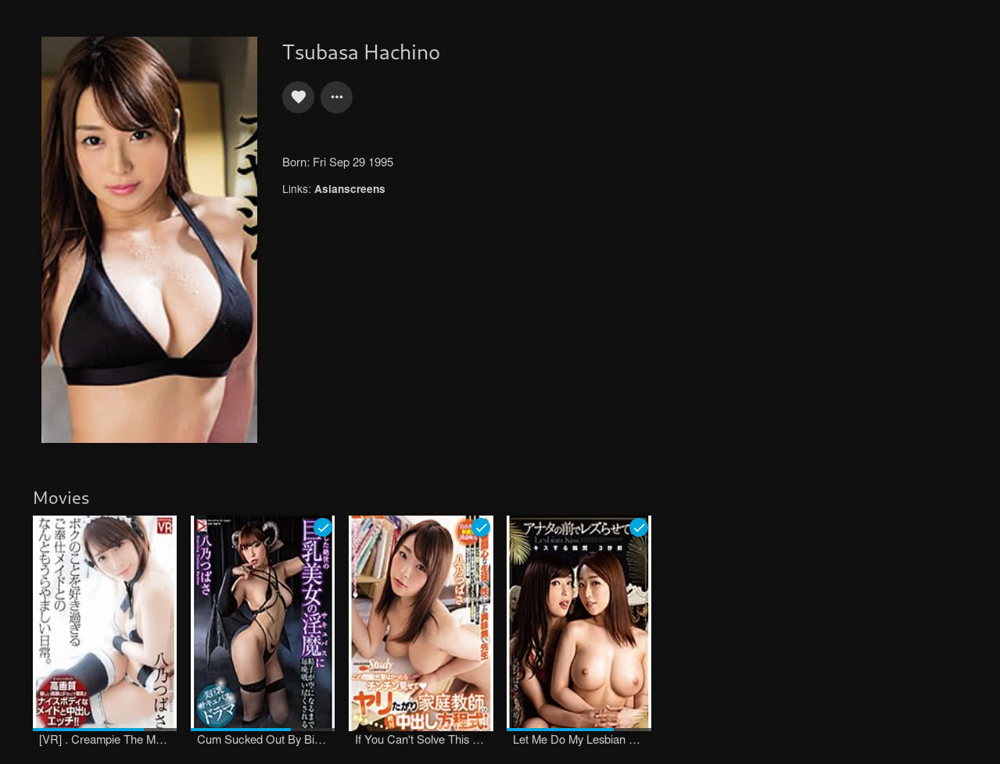

# JellyfinJav
Don't expect perfection.

# Metadata Providers
* R18 (Videos)
* JAVLibrary (Videos)
* AsianScreens (Actresses)
* Warashi Asian Pornstars (Actresses)

# Instructions
### Installation
Within your Jellyfin admin panel, go to Plugins -> Repositories, and add
https://raw.githubusercontent.com/imaginary-upside/JellyfinJav/master/manifest.json.
Then switch over to the Catalog tab and install the latest version.

### Usage
When adding the media library, make sure to select "Content type: movies".

### Example File Names
* abp200.mkv
* ABP200.mkv
* ABP-200.mkv
* some random text abp-200 more random text.mkv

# Development
### Requirements
* Docker
* Docker Compose
* Python
* .NET 5.0

### Building
    $ ./build.sh
    # Visit localhost:8096

### Packaging
    $ python package.py
    # manifest.json will update, and the package will be zipped up in release/

### General
JAV files for testing purposes are stored in videos/

# Screenshots

# License
Licensed under AGPL-3.0-only
